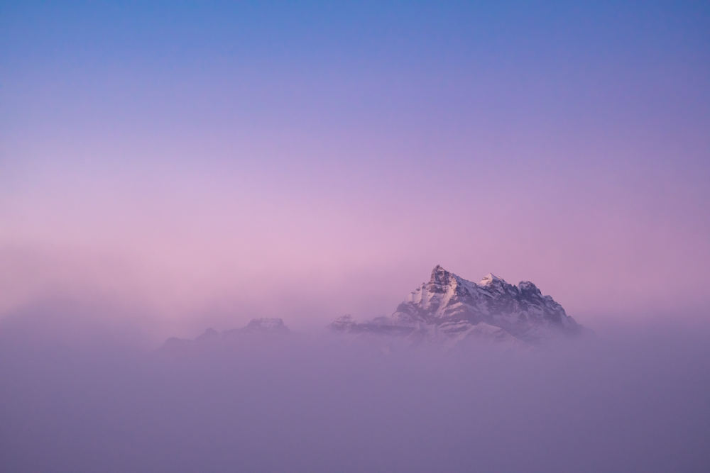
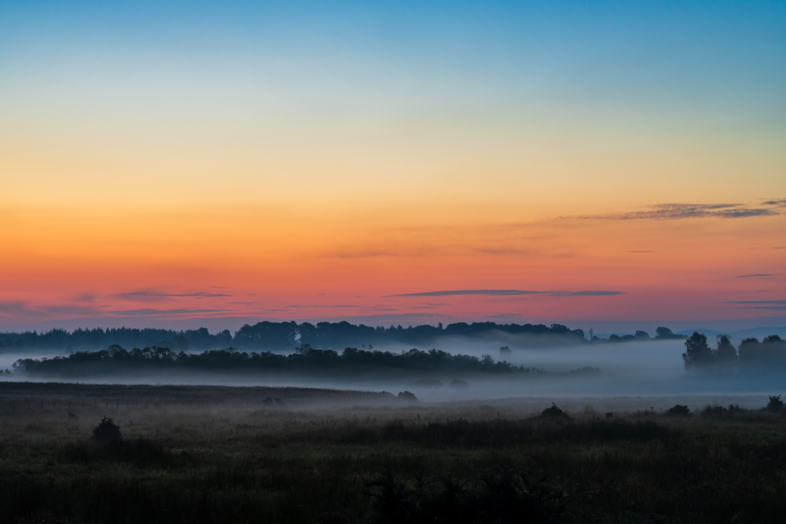
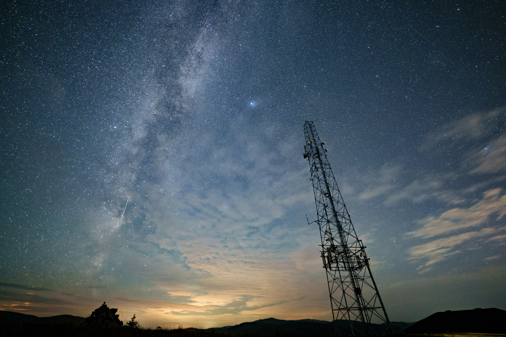
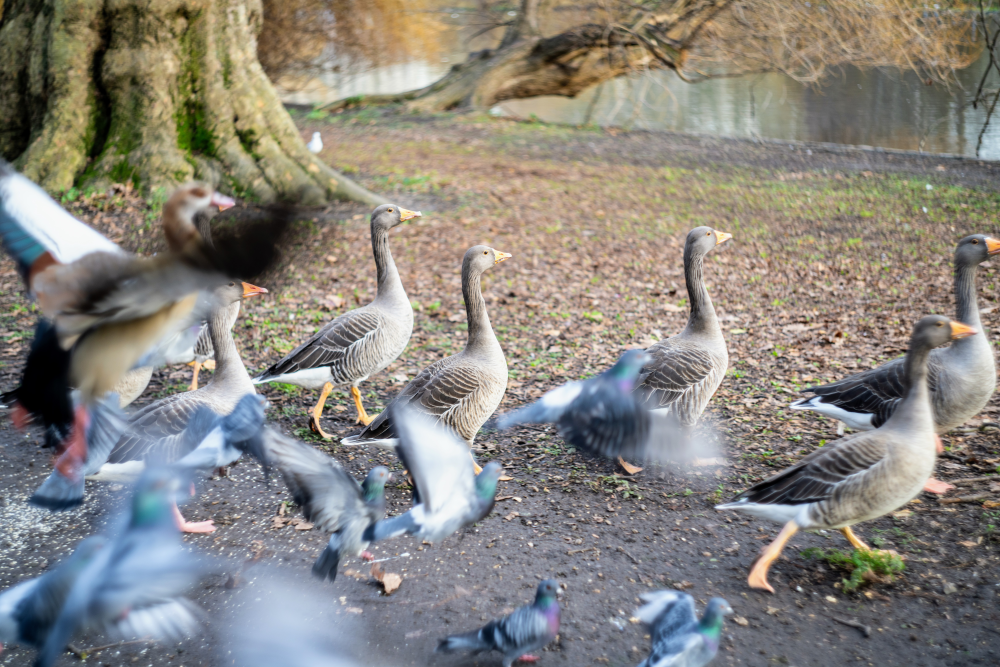
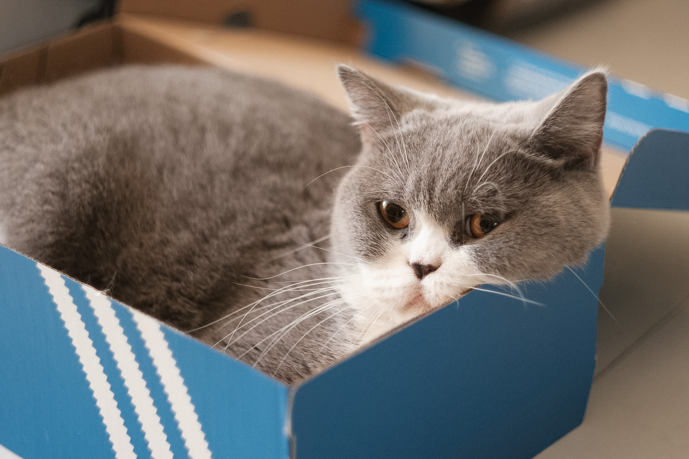

I've been taking photos as a hobby since I picked up my first DSLR in 2013 when I was living in London. I mostly take photos of landscapes, cityscapes, animals and my friends. I've unfortunately developed GAS (Gear Acquisition Syndrome) but currently restricted by my budget since becoming a PhD student. I mostly use a Sony A7RV and Fujifilm X-E5 with a variety of lenses.

---

##### Links

- [Instagram](https://www.instagram.com/taylorlorlor/)
- [Google Photos](https://photos.app.goo.gl/axg5ijKEUWTN1prr7)

---

##### Gallery

Some of my favourite photos I've taken over the years.

