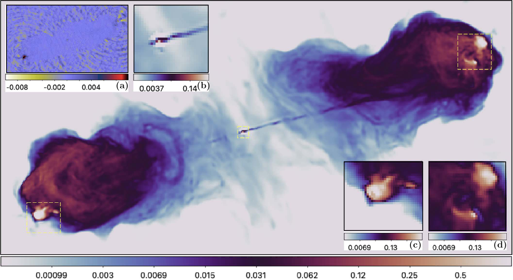

---

##### Download

- [Paper (arXiv)](https://arxiv.org/abs/2309.03291)
- [Paper (journal)](https://iopscience.iop.org/article/10.3847/2041-8213/ad41df/)
- [Code and data](https://github.com/basp-group/R2D2-RI/tree/r2d2-python-v1.0)
- [Tutorial](https://github.com/basp-group/R2D2-RI/blob/r2d2-python-v1.0/tutorial_r2d2_python.ipynb)

---

##### Abstract

A novel deep-learning paradigm for synthesis imaging by radio interferometry in astronomy was recently proposed, dubbed “Residual-to-Residual DNN series for high-Dynamic range imaging” (R2D2). In this work, we start by shedding light on R2D2's algorithmic structure, interpreting it as a learned version of CLEAN with minor cycles substituted with a deep neural network (DNN) whose training is iteration-specific. We then proceed with R2D2's first demonstration on real data, for monochromatic intensity imaging of the radio galaxy Cygnus A from S-band observations with the Very Large Array. We show that the modeling power of R2D2's learning approach enables delivering high-precision imaging, superseding the resolution of CLEAN, and matching the precision of modern optimization and plug-and-play algorithms, respectively uSARA and AIRI. Requiring few major-cycle iterations only, R2D2 provides a much faster reconstruction than uSARA and AIRI, known to be highly iterative, and is at least as fast as CLEAN.

---

##### Figure 3: R3D3 reconstruction of the radio galaxy Cygnus A observed by the Very Large Array (VLA) at S band (2.052 GHz) using configuration A and C, displayed in $\textrm{log}_{10}$ scale.



---

##### Citation

Dabbech, Arwa, Amir Aghabiglou, Chung San Chu, and Yves Wiaux. "CLEANing Cygnus A deep and fast with R2D2." The Astrophysical Journal Letters 966, no. 2 (2024): L34. https://iopscience.iop.org/article/10.3847/2041-8213/ad41df/.

```BibTeX
@article{dabbech2024cleaning,
  title={CLEANing Cygnus A deep and fast with R2D2},
  author={Dabbech, Arwa and Aghabiglou, Amir and Chung San, Chu and Wiaux, Yves},
  journal={The Astrophysical Journal Letters},
  volume={966},
  number={2},
  pages={L34},
  year={2024},
  publisher={IOP Publishing},
  url={https://iopscience.iop.org/article/10.3847/2041-8213/ad41df/}
}
```

<!-- ---

##### Related material

- [Presentation slides](presentation1.pdf)
- [Summary of the paper](https://www.penguinrandomhouse.com/books/110403/unusual-uses-for-olive-oil-by-alexander-mccall-smith/) -->
