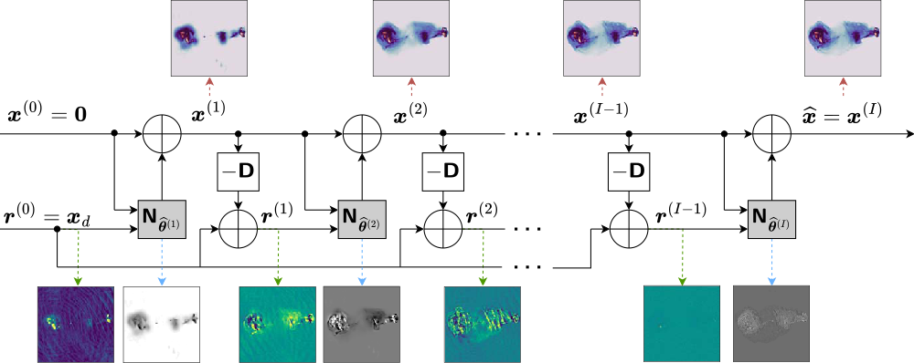

---

##### Download

- [Paper (arXiv)](https://arxiv.org/abs/2403.05452)
- [Paper (journal)](https://iopscience.iop.org/article/10.3847/1538-4365/ad46f5/)
- [Code and data](https://github.com/basp-group/R2D2-RI/tree/r2d2-python-v1.0)
- [Tutorial](https://github.com/basp-group/R2D2-RI/blob/r2d2-python-v1.0/tutorial_r2d2_python.ipynb)

---

##### Abstract

Radio-interferometric imaging entails solving high-resolution high-dynamic-range inverse problems from large data volumes. Recent image reconstruction techniques grounded in optimization theory have demonstrated remarkable capability for imaging precision, well beyond CLEAN’s capability. These range from advanced proximal algorithms propelled by handcrafted regularization operators, such as the SARA family, to hybrid plug-and-play (PnP) algorithms propelled by learned regularization denoisers, such as AIRI. Optimization and PnP structures are however highly iterative, which hinders their ability to handle the extreme data sizes expected from future instruments. To address this scalability challenge, we introduce a novel deep-learning approach, dubbed “Residual-to-Residual DNN series for high-Dynamic-range imaging” or in short R2D2. R2D2's reconstruction is formed as a series of residual images, iteratively estimated as outputs of deep neural networks (DNNs) taking the previous iteration’s image estimate and associated data residual as inputs. It thus takes a hybrid structure between a PnP algorithm and a learned version of the matching pursuit algorithm that underpins CLEAN. We present a comprehensive study of our approach, featuring its multiple incarnations distinguished by their DNN architectures. We provide a detailed description of its training process, targeting a telescope-specific approach. R2D2's capability to deliver high precision is demonstrated in simulation, across a variety of image and observation settings using the Very Large Array. Its reconstruction speed is also demonstrated: with only a few iterations required to clean data residuals at dynamic ranges up to $10^5$, R2D2 opens the door to fast precision imaging. R2D2 codes are available in the BASPLib (https://basp-group.github.io/BASPLib/) library on GitHub.

---

##### Figure 1: Illustration of the R2D2 algorithm



---

##### Citation

Aghabiglou, Amir, Chung San Chu, Arwa Dabbech, and Yves Wiaux. "The R2D2 deep neural network series paradigm for fast precision imaging in radio astronomy." The Astrophysical Journal Supplement Series 273, no. 1 (2024): 3. https://iopscience.iop.org/article/10.3847/1538-4365/ad46f5/.

```BibTeX
@article{aghabiglou2024r2d2,
  title={The R2D2 deep neural network series paradigm for fast precision imaging in radio astronomy},
  author={Aghabiglou, Amir and Chu, Chung San and Dabbech, Arwa and Wiaux, Yves},
  journal={The Astrophysical Journal Supplement Series},
  volume={273},
  number={1},
  pages={3},
  year={2024},
  publisher={IOP Publishing},
  url={https://iopscience.iop.org/article/10.3847/1538-4365/ad46f5/}
}
```

## <!--

##### Related material

- [Presentation slides](presentation2.pdf)
- [Wikipedia entry](https://en.wikipedia.org/wiki/The_Finer_Points_of_Sausage_Dogs) -->
