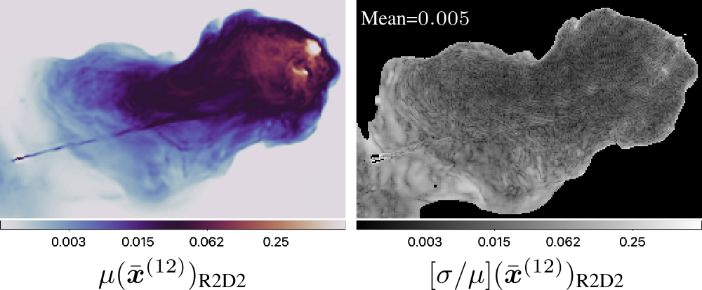

---

##### Download

- [Paper (arXiv)](https://arxiv.org/abs/2403.18052)
- [Paper (conference)](https://ieeexplore.ieee.org/abstract/document/10715010/)
- [Code and data](https://github.com/basp-group/R2D2-RI/tree/main)
- [Tutorial](https://github.com/basp-group/R2D2-RI/blob/main/tutorial_r2d2_python_v2.ipynb)

---

##### Abstract

The “Residual-to-Residual DNN series for high-Dynamic range imaging” (R2D2) approach was recently introduced for Radio-Interferometric (RI) imaging in astronomy. R2D2's reconstruction is formed as a series of residual images, iteratively estimated as outputs of Deep Neural Networks (DNNs) taking the previous iteration's image estimate and associated data residual as inputs. In this work, we investigate the robustness of the R2D2 image estimation process, by studying the uncertainty associated with its series of learned models. Adopting an ensemble averaging approach, multiple series can be trained, arising from different random DNN initializations of the training process at each iteration. The resulting multiple R2D2 instances can also be leveraged to generate “R2D2 samples”, from which empirical mean and standard deviation endow the algorithm with a joint estimation and uncertainty quantification functionality. Focusing on RI imaging, and adopting a telescope-specific approach, multiple R2D2 instances were trained to encompass the most general observation setting of the Very Large Array (VLA). Simulations and real-data experiments confirm that: (i) R2D2's image estimation capability is superior to that of the state-of-the-art algorithms; (ii) its ultra-fast reconstruction capability (arising from series with only few DNNs) makes the computation of multiple reconstruction samples and of uncertainty maps practical even at large image dimension; (iii) it is characterized by a very low model uncertainty.

---

##### Figure 4: Visual illustration of the R2D2 joint image estimation and uncertainty quantification functionality for the Cygnus A VLA data.



---

##### Citation

Aghabiglou, Amir, Chung San Chu, Arwa Dabbech, and Yves Wiaux. "R2D2 image reconstruction with model uncertainty quantification in radio astronomy." In 2024 32nd European Signal Processing Conference (EUSIPCO), pp. 1926-1931. IEEE, 2024. https://ieeexplore.ieee.org/abstract/document/10715010.

```BibTeX
@inproceedings{aghabiglou2024r2d2,
  title={R2D2 image reconstruction with model uncertainty quantification in radio astronomy},
  author={Aghabiglou, Amir and San Chu, Chung and Dabbech, Arwa and Wiaux, Yves},
  booktitle={2024 32nd European Signal Processing Conference (EUSIPCO)},
  pages={1926--1931},
  year={2024},
  organization={IEEE},
  url={https://ieeexplore.ieee.org/abstract/document/10715010}
}
```

<!-- ---

##### Related material

+ [Nontechnical summary](https://www.alexandermccallsmith.com/book/your-inner-hedgehog) -->
