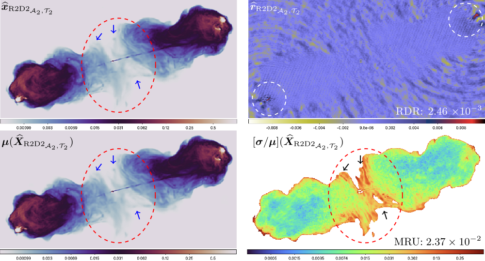

---

##### Download

- [Paper (arXiv)](https://arxiv.org/pdf/2503.02554)
- [Code and data](https://github.com/basp-group/R2D2-RI/tree/main)
- [Tutorial](https://github.com/basp-group/R2D2-RI/blob/main/tutorial_r2d2_python_v2.ipynb)
<!-- - [Paper (journal)](https://ieeexplore.ieee.org/abstract/document/10715010/) -->

---

##### Abstract

The R2D2 Deep Neural Network (DNN) series was recently introduced for image formation in radio interferometry. It can be understood as a learned version of CLEAN, whose minor cycles are substituted with DNNs. We revisit R2D2 on the grounds of series convergence, training methodology, and DNN architecture, improving its robustness in terms of generalisability beyond training conditions, capability to deliver high data fidelity, and epistemic uncertainty. Firstly, while still focusing on telescope-specific training, we enhance the learning process by randomising Fourier sampling integration times, incorporating multi-scan multi-noise configurations, and varying imaging settings, including pixel resolution and visibility-weighting scheme. Secondly, we introduce a convergence criterion whereby the reconstruction process stops when the data residual is compatible with noise, rather than simply using all available DNNs. This not only increases the reconstruction efficiency by reducing its computational cost, but also refines training by pruning out the data/image pairs for which optimal data fidelity is reached before training the next DNN. Thirdly, we substitute R2D2's early U-Net DNN with a novel architecture (U-WDSR) combining U-Net and WDSR, which leverages wide activation, dense connections, weight normalisation, and low-rank convolution to improve feature reuse and reconstruction precision. As previously, R2D2 was trained for monochromatic intensity imaging with the Very Large Array (VLA) at fixed 512$\times$512 image size. Simulations on a wide range of inverse problems and a case study on real data reveal that the new R2D2 model consistently outperforms its earlier version in image reconstruction quality, data fidelity, and epistemic uncertainty.

---

##### Figure 6: Visual illustration of the R2D2 joint image estimation and uncertainty quantification functionality for the Cygnus A VLA data.



---

##### Citation

Aghabiglou, Amir, Chung San Chu, Chao Tang, Arwa Dabbech, and Yves Wiaux. "Towards a robust R2D2 paradigm for radio-interferometric imaging: revisiting DNN training and architecture." arXiv preprint arXiv:2503.02554 (2025). https://arxiv.org/pdf/2503.02554.

```BibTeX
@article{aghabiglou2025towards,
  title={Towards a robust R2D2 paradigm for radio-interferometric imaging: revisiting DNN training and architecture},
  author={Aghabiglou, Amir and Chu, Chung San and Tang, Chao and Dabbech, Arwa and Wiaux, Yves},
  journal={arXiv preprint arXiv:2503.02554},
  year={2025},
  url={https://arxiv.org/pdf/2503.02554}
}
```

<!-- ---

##### Related material

+ [Nontechnical summary](https://www.alexandermccallsmith.com/book/your-inner-hedgehog) -->
