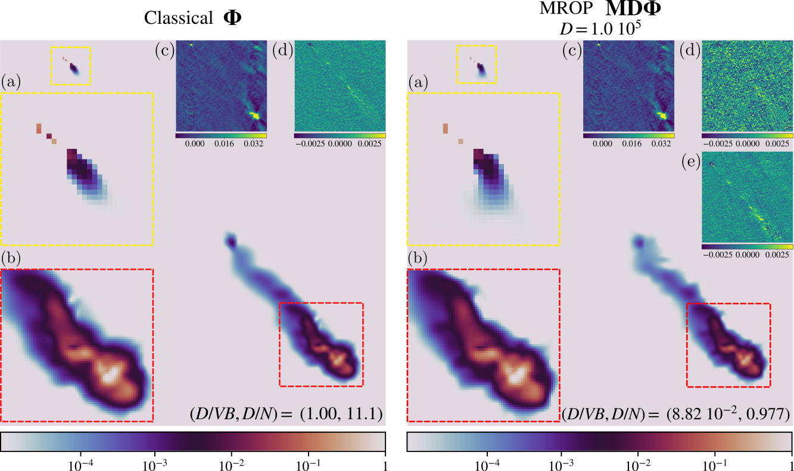

---

##### Download

- [Paper (journal)](https://academic.oup.com/mnras/advance-article/doi/10.1093/mnras/staf1510/8250644)
- [Paper (arXiv)](https://arxiv.org/abs/2504.18446)
- Code and data (TBA)
- Tutorial (TBA)

---

##### Abstract

The emerging generation of radio-interferometric (RI) arrays are set to form images of the sky with a new regime of sensitivity and resolution. This implies a significant increase in visibility data volumes, which for single-frequency observations will scale as $\mathcal{O}(Q^2B)$ for $Q$ antennas and $B$ short-time integration intervals (or batches), calling for efficient data dimensionality reduction techniques. This paper proposes a new approach to data compression during acquisition, coined modulated rank-one projection (MROP). MROP compresses the $Q\times Q$ batchwise covariance matrix into a smaller number P of random rank-one projections and compresses across time by trading B for a smaller number M of random modulations of the ROP measurement vectors. Firstly, we introduce a dual perspective on the MROP acquisition, which can either be understood as random beamforming, or as a post-correlation compression. Secondly, we analyse the noise statistics of MROPs and demonstrate that the random projections induce a uniform noise level across measurements independently of the visibility-weighting scheme used. Thirdly, we propose a detailed analysis of the memory and computational cost requirements across the data acquisition and image reconstruction stages, with comparison to state-of-the-art dimensionality reduction approaches. Finally, the MROP model is validated for monochromatic intensity imaging both in simulation and from real data, with comparison to the classical and baseline-dependent averaging (BDA) models, and using the uSARA optimisation algorithm for image formation. Our results suggest that the data size necessary to preserve imaging quality using MROPs is reduced to the order of image size, well below the original and BDA data sizes.

---

##### Figure 9: Reconstruction of the quasar 3C 273 from VLA data using the MROP acquisition model and the uSARA imaging algorithm, compared to the classical model (no compression).



---

##### Citation

Leblanc, Olivier, Chung San Chu, Laurent Jacques, and Yves Wiaux. "MROP: Modulated Rank-One Projections for compressive radio interferometric imaging." Monthly Notices of the Royal Astronomical Society (2025): staf1510. https://academic.oup.com/mnras/advance-article/doi/10.1093/mnras/staf1510/8250644.

```BibTeX
@article{leblanc2025mrop,
  title={MROP: Modulated Rank-One Projections for compressive radio interferometric imaging},
  author={Leblanc, Olivier and Chu, Chung San and Jacques, Laurent and Wiaux, Yves},
  journal={Monthly Notices of the Royal Astronomical Society},
  pages={staf1510},
  year={2025},
  publisher={Oxford University Press},
  url={https://academic.oup.com/mnras/advance-article/doi/10.1093/mnras/staf1510/8250644}
}
```

<!-- ---

##### Related material

+ [Nontechnical summary](https://www.alexandermccallsmith.com/book/your-inner-hedgehog) -->
