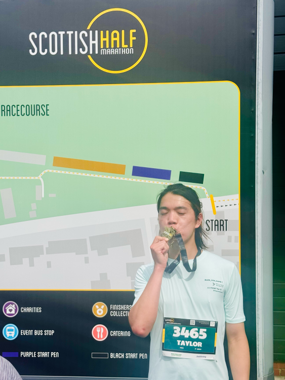

##### Why I run

I started running in the beginning of 2024 to lose weight and improve my cardiovascular health. I signed up to the Edinburgh Half Marathon race in August 2024 as a goal to work towards. Since then, I have been running regularly so that I can enjoy all the snacks I want without worrying about gaining weight.

---

##### Links

- [Strava](https://strava.app.link/bGfmS9UTOWb)
- [Parkrun](https://www.parkrun.org.uk/parkrunner/9518039/)

---

##### Personal Bests

| Distance      | Time    | Date       | Location                  |
| ------------- | ------- | ---------- | ------------------------- |
| 5K            | 21:16   | 2024-11-09 | Edinburgh (Cramond)       |
| 10K           | 46:31   | 2025-06-14 | Edinburgh (Holyrood Park) |
| Half Marathon | 1:43:14 | 2025-05-25 | Edinburgh to Musselburg   |

---

##### Races

| Distance      | Time    | Date       | Event                                  |
| ------------- | ------- | ---------- | -------------------------------------- |
| Half Marathon | 1:51:28 | 2024-08-25 | Scottish Half Marathon 2024            |
| Half Marathon | 1:44:56 | 2025-02-01 | Edinburgh Winter Warmer Run 2025       |
| Half Marathon | 1:43:12 | 2025-05-25 | Edinburgh Marathon Festival (EMF) 2025 |

---

##### Photos

##### Scottish Half Marathon 2024

<!-- create a gallery with photos

  
  
  
  

 -->